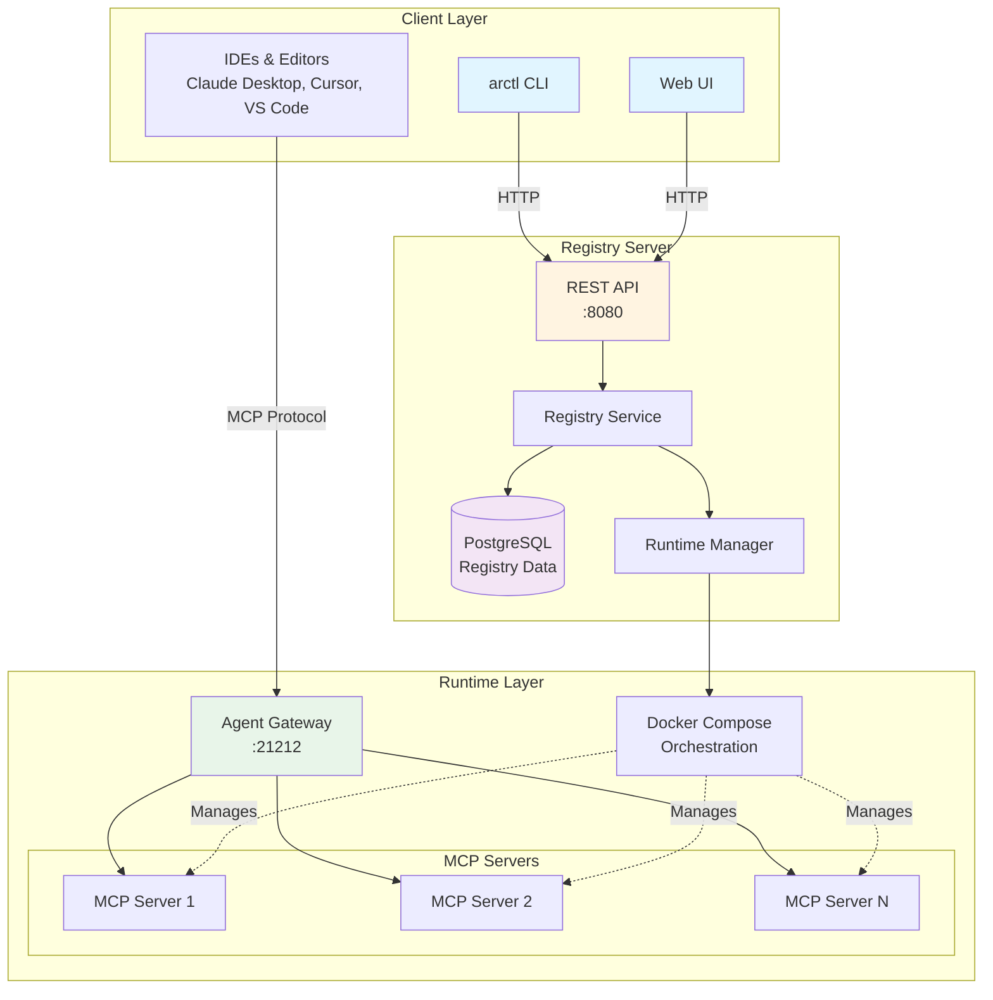
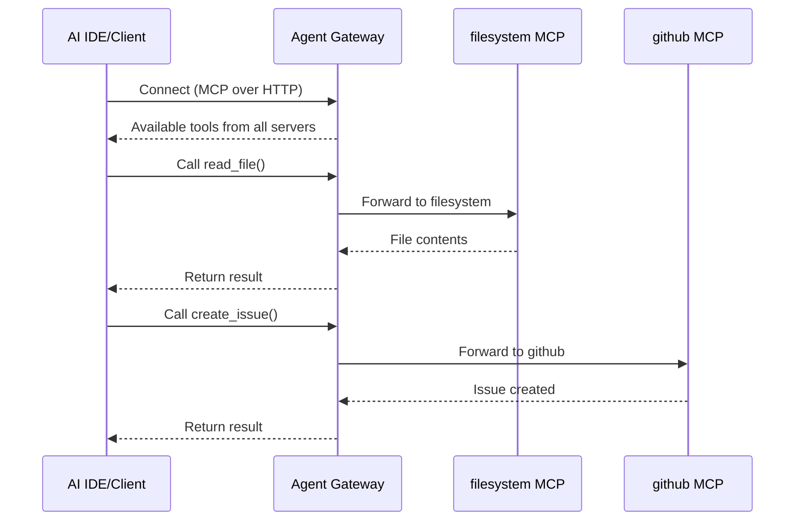

# Agent Registry

> **A comprehensive platform for discovering, deploying, and managing MCP (Model Context Protocol) servers**

Agent Registry (`arctl`) is a unified system that combines a centralized registry, runtime management, and development tooling for MCP servers. It enables teams to publish, discover, and deploy AI agent capabilities as composable services.

[](https://golang.org/doc/install)
[](LICENSE)

## 🎯 What is Agent Registry?

Agent Registry solves the challenge of managing AI agent capabilities by providing:

- **📦 Centralized Registry**: Discover and publish MCP servers, skills, and agents
- **🚀 Automated Deployment**: Deploy MCP servers locally or remotely with one command
- **🔧 Developer Tools**: Scaffolding and code generators for Python and Go MCP servers
- **🌐 Web UI**: Beautiful dashboard for managing your agent ecosystem
- **🔌 Agent Gateway**: Unified endpoint for all your MCP servers
- **🐳 Container Orchestration**: Automated Docker Compose management

## 🏗️ Architecture



## 🚀 Quick Start

### Prerequisites

- Docker Desktop with Docker Compose v2+
- Go 1.25+ (for building from source)

### Installation

```bash
# Install via script (recommended)
curl -fsSL https://raw.githubusercontent.com/agentregistry-dev/agentregistry/main/scripts/get-arctl | bash

# Or download binary directly from releases
# https://github.com/agentregistry-dev/agentregistry/releases

# Or build from source
make build
```

### Start the Registry

```bash
# Start the registry server and PostgreSQL
arctl mcp list

# This automatically starts:
# - PostgreSQL database (port 5432)
# - Registry server (port 12121)
# - Imports built-in seed data
```

### Deploy Your First MCP Server

```bash
# List available MCP servers
arctl mcp list

# Deploy a server
arctl deploy mcp filesystem --version latest

# The server is now available through the Agent Gateway!
```

### Access the Web UI

```bash
# Launch the embedded web interface
arctl ui

# Open http://localhost:8080 in your browser
```

## 📚 Core Concepts

### MCP Servers

MCP (Model Context Protocol) servers are services that provide tools, resources, and prompts to AI agents. They're the building blocks of agent capabilities.

**Example MCP Servers:**
- `filesystem` - File operations
- `github` - GitHub API integration
- `brave-search` - Web search capabilities
- `postgres` - Database queries

### Agent Gateway

The Agent Gateway (`kagent`) is a reverse proxy that provides a single MCP endpoint for all deployed servers:




## 🛠️ CLI Commands

### Registry Operations

```bash
# List available MCP servers
arctl list mcp

# Search for servers
arctl list mcp --search github

# Show server details
arctl show mcp github

# Show specific version
arctl show mcp github --version 0.1.0
```

### Deployment Operations

```bash
# Deploy MCP server
arctl deploy mcp <server-name> --version <version>

# Deploy with environment variables
arctl deploy mcp postgres \
  --env DATABASE_URL=postgres://localhost/mydb \
  --env DB_SCHEMA=public

# Deploy with runtime arguments
arctl deploy mcp custom-server \
  --arg port=8080 \
  --arg debug=true

# Remove deployed server
arctl remove mcp <server-name>

```

### IDE Configuration

Configure your AI-powered IDEs to use the Agent Gateway:

```bash
# Generate Claude Desktop config
arctl configure claude-desktop

# Generate Cursor config
arctl configure cursor

# Generate VS Code config
arctl configure vscode
```


## 🎨 Web UI

The embedded web interface provides a visual dashboard for:

- 📊 **Dashboard**: Overview of servers, deployments, and statistics
- 🔍 **Discovery**: Browse and search the registry
- 🚀 **Deployments**: Visual deployment management
- ⚙️ **Configuration**: Server settings and environment variables
- 📈 **Monitoring**: Deployment status and health


## 🤝 Contributing

We welcome contributions! Please see [`CONTRIBUTING.md`](CONTRIBUTING.md) for guidelines.

**Development setup:**

See [`DEVELOPMENT.md`](DEVELOPMENT.md) for detailed architecture information.

## 📄 License

MIT License - see [`LICENSE`](LICENSE) for details.

## 🔗 Related Projects

- [Model Context Protocol](https://modelcontextprotocol.io/)
- [kagent](https://github.com/kagent-dev/kagent)
- [MCP Go SDK](https://github.com/modelcontextprotocol/go-sdk)
- [FastMCP](https://github.com/jlowin/fastmcp)

## 📞 Support

- 📖 [Documentation](https://agentregistry.dev/docs)
- 💬 [GitHub Discussions](https://github.com/agentregistry-dev/agentregistry/discussions)
- 🐛 [Issue Tracker](https://github.com/agentregistry-dev/agentregistry/issues)
- 📧 Email: support@agentregistry.dev

---

**Built with ❤️ for the AI agent community**
